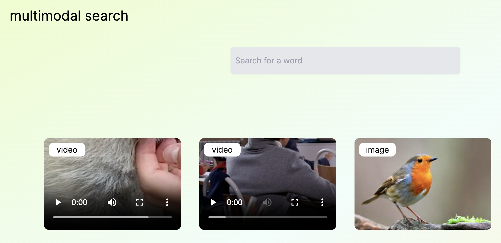

## This is a Multimodal Search demo built with [Weaviate](https://weaviate.io), [ImageBind](https://imagebind.metademolab.com/) and [Next.js](https://nextjs.org/) 

👨🏾‍🍳 Blogpost - [Building Multimodal AI in TypeScript
](https://weaviate.io/blog/multimodal-search-in-typescript)



## 🐥 Getting Started

First, clone the project with the command below

```bash
git clone https://github.com/malgamves/next-multimodal-search-demo
```

The repository lets us do three things
1. Run the Next.js Web App.
2. Run an instance of Weaviate.
3. Import images, audio and videos into your Weaviate database.


### 🏗️ Running Weaviate  
> Note that the first time you run it, Docker will download ~4.8GB multi2vec-bind Weaviate module, which contains the ImageBind model.

To start the Weaviate instance, run the following command, which will use the `docker-compose.yml` file.
```bash
docker compose up -d
```


### 📩 Importing Data
> Before you can import data, add any files to their respective media type in the `public/` folder. 

With your data in the right folder, run `yarn install` to install all project dependencies and to import your data into Weaviate and initialise a collection, run:
```bash
yarn run import
```

this may take a minute or two.


### 🚀 Running your Next.js Application.
> Make sure you have your Weaviate instance running with data imported before starting your Next.js Web App.

To run the Web App
```bash
yarn dev
```

... and you can search away!! 


### 📚 Resources

Learn more about multimodal applications
- [Multimodal Retrieval Augmented Generation(RAG)](https://weaviate.io/blog/multimodal-rag)
- [Multimodal Embedding Models](https://weaviate.io/blog/multimodal-models)


### 🤷🏾‍♂️ Troubleshooting

- Check out the [Weaviate Docs](https://weaviate.io/developers/weaviate)
- [Open an Issue](https://github.com/malgamves/next-multimodal-search-demo/issues)


Some credit goes to Steven for his [Spirals template](https://github.com/steven-tey/spirals)

